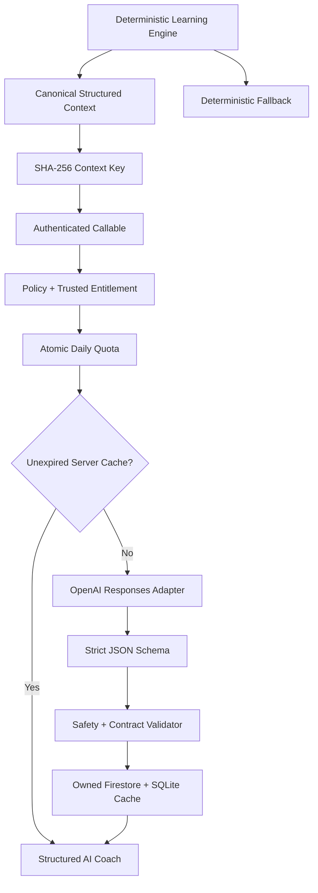

# ExamCoach — AI System Architecture

## Positioning

AI Coach is a controlled interpretation layer over the deterministic learning
engine. Its repository implementation is available from Step 11; production use
requires the explicit setup in
`../engineering/AI_Coach_and_Subscriptions.md`.

## Implemented Flow



## Responsibilities

- summarize an already-computed result;
- explain structured weakness evidence;
- explain why the deterministic recommendation matters;
- create a study schedule only when the trusted plan enables it; and
- provide concise motivation.

## Restrictions

AI must not:

- calculate official score or correctness;
- independently decide weakness, recommendation, or question selection;
- manufacture readiness, percentile, or evidence;
- guarantee passing; or
- override deterministic learning state.

The server prompt states these boundaries, and the response validator rejects
malformed output and common passing-guarantee language. The UI repeats that AI
is explanatory and always presents deterministic insight independently.

## Structured Input

```json
{
  "schemaVersion": 1,
  "sourceSessionId": "session_id",
  "examId": "exam_cpns",
  "testId": "test_tiu",
  "scorePercentage": 67,
  "completedAt": "2026-09-11T09:00:00.000Z",
  "topWeaknesses": [
    {
      "taxonomyNodeId": "topic_ratio",
      "label": "Perbandingan",
      "weaknessBasisPoints": 7000,
      "confidenceBasisPoints": 8000,
      "sampleSize": 4,
      "trend": "stable",
      "evidence": ["Akurasi masih di bawah target."]
    }
  ],
  "recommendation": {
    "type": "adaptiveDrill",
    "targetTaxonomyId": "topic_ratio",
    "targetLabel": "Perbandingan",
    "reasonCode": "repeatedLowAccuracy",
    "reason": "Kesalahan muncul berulang.",
    "expectedBenefit": "Perkuat ketepatan rasio.",
    "estimatedMinutes": 15,
    "confidenceBasisPoints": 8000
  }
}
```

Integers and basis points avoid cross-runtime floating-point ambiguity. Object
keys are recursively sorted and hashed on Flutter and Functions; the server
rebuilds and verifies the context key before any quota or provider call.

## Structured Output

The provider returns five bounded fields: summary, weakness explanation, why it
matters, zero to seven study-plan items, and motivation. Free plans receive no
schedule even if a provider attempts to return one. Provider/model/prompt
metadata and explicit generated/expiry timestamps accompany the response.

## Cost and Failure Strategy

- plan-based server quota from a configurable Firestore policy;
- UTC-day usage records and atomic reservation;
- no second charge for an unexpired identical context;
- compact prompt, strict structured output, and 700-token output ceiling;
- provider abstraction and token usage retained server-side;
- `store: false`, hashed safety identifier, and stable prompt cache key;
- 30-second provider timeout and bounded callable timeouts;
- deterministic fallback and valid local-cache reading during failure; and
- capability-aware server cache reuse, so a verified upgrade regenerates a
  previously Free insight before enabling a paid study plan.

No provider secret exists in the app. The OpenAI adapter is selected only from
the `AI_PROVIDER_CONFIG` Functions secret. Emulator output is available only
when both Firebase Emulator and the explicit ExamCoach test flag are active.
