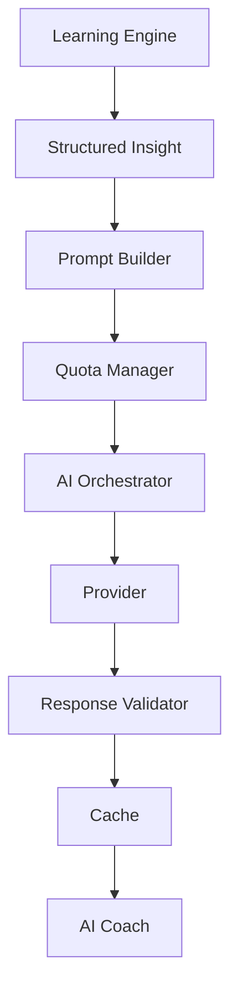

# ExamCoach — AI System Architecture

## Positioning
AI Coach is a controlled intelligence layer over the deterministic learning engine.

## Flow



## AI Responsibilities
- summarize performance
- explain weaknesses
- create study schedules
- motivate
- translate structured facts into natural language

## AI Restrictions
AI must not:
- calculate official score
- determine correctness
- independently decide weakness
- independently select the next question
- guarantee passing

## Structured Input

```json
{
  "exam": "CPNS",
  "test": "TIU",
  "readiness": 0.62,
  "topWeaknesses": [
    {
      "taxonomyNodeId": "ratio",
      "score": 0.81,
      "confidence": 0.86,
      "trend": "improving"
    }
  ],
  "recommendedAction": {
    "type": "adaptive_drill",
    "target": "ratio"
  }
}
```

## Cost Strategy
- quota by plan
- compact prompts
- structured outputs
- caching
- rate limiting
- provider abstraction
- cost tracking

If AI fails, deterministic insight must still work.
