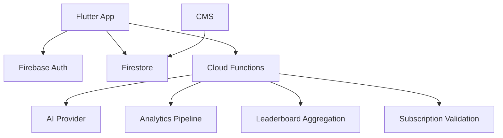

# ExamCoach — Backend Service Architecture

## High-Level Flow

## Services
- auth
- content
- sync
- analytics
- learning intelligence
- AI
- quota
- leaderboard
- subscription
- notification

## Cloud Functions
Use for trusted operations:
- AI requests
- entitlement validation
- server quota
- leaderboard aggregation
- analytics processing
- scheduled jobs

## Security
Validate authenticated user, entitlement, quota, and request shape. Never expose AI provider secrets.

## Leaderboard
Prefer precomputed snapshots over expensive global realtime queries.

## Scalability
Start simple with Firebase. Introduce specialized services only when scale/query requirements justify them. Avoid premature microservices.
