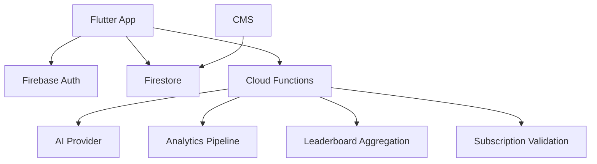

# ExamCoach — Backend Service Architecture

## High-Level Flow

## Implemented Mobile Sync Boundary

The app now has a provider-neutral `SyncRemoteGateway` contract and a tested
connectivity-aware worker over its transactional SQLite outbox. The worker
batches ready operations, applies accepted/duplicate/superseded
acknowledgements, schedules exponential retries, quarantines permanent failures,
and prunes old synced delivery records without touching local learning results.

There is intentionally no production Firebase gateway or bootstrap registration
yet. Those require authenticated ownership, Firestore security rules, a remote
idempotency ledger, and revision validation in Step 10. Until that boundary is
implemented, all learning continues offline and outbox operations remain
pending. See `../engineering/Sync_Architecture.md`.

## Services
- auth
- content
- sync
- analytics
- learning intelligence
- AI
- quota
- leaderboard
- subscription
- notification

## Cloud Functions
Use for trusted operations:
- AI requests
- entitlement validation
- server quota
- leaderboard aggregation
- analytics processing
- scheduled jobs

## Security
Validate authenticated user, entitlement, quota, and request shape. Never expose AI provider secrets.

Every sync request must authorize the authenticated user against the submitted
entity, deduplicate by stable operation ID, validate allowed session state and
version transitions, and return exactly one explicit outcome for each operation.
Connectivity state is only a trigger; request timeouts and transport failures
must remain safe to retry.

## Leaderboard
Prefer precomputed snapshots over expensive global realtime queries.

## Scalability
Start simple with Firebase. Introduce specialized services only when scale/query requirements justify them. Avoid premature microservices.
