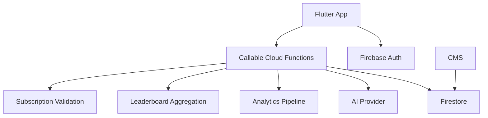

# ExamCoach — Backend Service Architecture

## High-Level Flow

## Implemented Authenticated Sync Boundary

The app now has a provider-neutral `SyncRemoteGateway` contract and a tested
connectivity-aware worker over its transactional SQLite outbox. The worker
batches ready operations, applies accepted/duplicate/superseded
acknowledgements, schedules exponential retries, quarantines permanent failures,
and prunes old synced delivery records without touching local learning results.

Step 10 adds an optional Firebase Auth adapter, authenticated callable gateway,
Cloud Functions, Firestore ownership rules, per-user revision, operation ledger,
and empty-device recovery. User learning mutations never write Firestore
directly: Functions derive the owner from the Auth context and validate stable
IDs, payloads, lifecycle, and forward revisions in transactions.

The repository is not connected to or deployed into a real Firebase project.
Without explicit Dart-define configuration the application stays safely local
and queued work remains pending. See `../engineering/Firebase_Integration.md`
for owner activation and `../engineering/Sync_Architecture.md` for protocol and
recovery semantics.

Step 11 adds authenticated `getAiCoachStatus`, `requestAiCoachInsight`, and
`refreshSubscriptionEntitlement` callables. AI policy, daily usage,
same-context request reservation/cache, and RevenueCat-verified entitlement are
server-owned. AI uses a secret-bound OpenAI adapter; subscription verification
uses a separate secret-bound RevenueCat REST adapter. The client cannot submit
its plan or mutate quota/entitlement documents. See
`../engineering/AI_Coach_and_Subscriptions.md` for activation and protocols.

## Services
- auth
- content
- sync
- analytics
- learning intelligence
- AI
- quota
- leaderboard
- subscription
- notification

## Cloud Functions
Use for trusted operations:
- authenticated outbox batch application;
- owned recovery snapshot reads;
- structured AI requests and response validation;
- RevenueCat entitlement refresh;
- atomic server quota and cache reservation;
- leaderboard aggregation
- analytics processing
- scheduled jobs

## Security
Validate authenticated user, entitlement, quota, and request shape. Never expose AI provider secrets.

Every implemented sync request authorizes the Auth UID against submitted
entities, verifies the deterministic operation ID, deduplicates by canonical
payload hash, validates session state/version transitions, and returns one
explicit outcome per operation. Firestore Rules deny all direct user-learning
writes and isolate reads to the owner. Admin SDK writes are restricted to the
Functions runtime/IAM boundary. Connectivity is only a trigger; request timeouts
and failures remain safe to retry.

Every AI/subscription request also derives identity from Auth. Provider and
RevenueCat server keys are JSON secret parameters bound only to their required
Functions. Public RevenueCat SDK keys are platform-specific app configuration
and never grant server entitlement authority.

## Leaderboard
Prefer precomputed snapshots over expensive global realtime queries.

## Scalability
Start simple with Firebase. Introduce specialized services only when scale/query requirements justify them. Avoid premature microservices.
