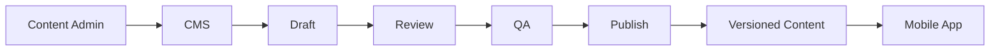

# ExamCoach — CMS System Architecture

## Content Flow

## Modules
- exam management
- test management
- taxonomy management
- question editor
- answer/explanation editor
- media
- import/export
- review workflow
- publishing
- versioning
- prompt management
- content analytics

## Question Governance
Every question needs:
- unique ID
- provenance
- taxonomy mapping
- answer
- explanation
- difficulty
- status
- author/reviewer
- version

## AI-Generated Content
AI-generated questions are drafts until human validation. AI must not automatically publish exam-critical content.

## Implemented Local Governance Boundary

Before the remote CMS exists, the repository CLI enforces the same core gate:

- deterministic structure and ID validation;
- exact and normalized prompt-similarity blocking;
- human review evidence bound to immutable content SHA-256;
- separate validated and published lifecycle transitions;
- immutable retained artifacts and manifest-selected distribution; and
- SQLite persistence of reviewer, provenance, checklist, publisher, and time
  evidence.

The AI generator cannot create schema-v2 reviewed artifacts through the import
path. A named human must complete the review record, and publication remains a
separate explicit action. See
`../operations/Human_Question_Review_Workflow.md`.

## Roles
- Super Admin
- Content Manager
- Author
- Reviewer
- QA
- Analyst

## Future
CMS becomes the foundation for multi-exam operations before teacher analytics/B2B expansion.
