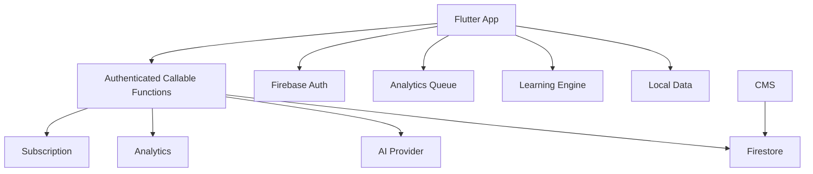

# ExamCoach — Technical Design Document (TDD)

## Objective
Define the technical blueprint for a scalable Flutter mobile product.

## Stack
### Mobile
Flutter, Dart, Bloc/Cubit, GoRouter, local persistence, dependency injection.

### Backend
Firebase Auth, Firestore, Cloud Functions, Remote Config, FCM, Crashlytics.

### Monetization
RevenueCat.

### AI
Server-side provider abstraction, orchestration, quota, cache.

## System

## Deterministic Core
Scoring, weakness analysis, recommendation, adaptive drill, and prediction must be deterministic and testable.

## Offline-First
Users should be able to download content, take tests, answer questions, finish tests, see scores, and receive local insight without requiring a live connection for every action.

## Sync
Local Write → Outbox/Queue → Retry → Server → Acknowledgement. Operations should be idempotent.

The implemented server boundary uses the authenticated UID, deterministic
operation IDs, a canonical-payload ledger, and per-user revisions. Inbound
recovery is allowed only into a matching account-bound database with no local
sessions; correctness and scores are recomputed by the local deterministic core.
See `../engineering/Firebase_Integration.md` and
`../engineering/Sync_Architecture.md`.

## Versioning
Version taxonomy, question content, scoring configuration, learning algorithms, analytics schemas, and AI prompts.

## Security
Use least privilege, secure rules, server-side authorization, and protected AI credentials.

Implemented user-learning writes go only through callable Functions. Firestore
clients may read their own tree but cannot write it directly. Firebase is
disabled when runtime configuration is absent or incomplete; no project or
server credential is embedded in the repository.

## Testing
Unit: learning engine.
Bloc: state transitions.
Integration: sync, analytics, AI.
E2E: onboarding → tryout → result → weakness → recommendation → drill → updated insight.

## Observability
Monitor crashes, sync failures, AI errors, quota failures, recommendation failures, analytics backlog, and subscription validation.

## Delivery Rule
Get the end-to-end learning loop working and testable before optimizing architecture.
