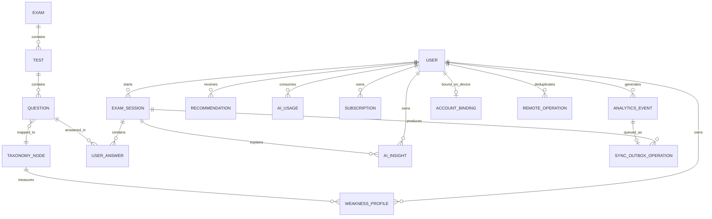

# ExamCoach — Database ERD

## Logical ERD

## Core Entities
- User
- Exam
- Test
- TaxonomyNode
- Question
- ExamSession
- UserAnswer
- WeaknessProfile
- Recommendation
- AIUsage
- AIInsight
- Subscription
- AnalyticsEvent
- SyncOutboxOperation
- AccountBinding
- RemoteOperation

## Important Fields
ExamSession: userId, testId, mode, start/end time, score, status, syncVersion.
UserAnswer: sessionId, questionId, selectedAnswer, isSkipped, correctness, timeSpentMs, changedAnswer.
WeaknessProfile: userId, taxonomyNodeId, score, confidence, sampleSize, trend.
Recommendation: userId, targetNodeId, reasonCode, priority, actionType, generatedAt, expiry.
QuestionPack: validationStatus, reviewer, reviewedAt, reviewNotes,
provenanceDecision, provenanceNotes, contentSha256, reviewChecklist,
publisher, publishedAt.
SyncOutboxOperation: operationId, entityType, entityId, operation, payloadJson,
createdAt, attempts, status, lastAttemptAt, nextAttemptAt, syncedAt,
deadLetteredAt, acknowledgement, remoteRevision.
AccountBinding: firebaseUid, boundAt, lastRecoveredAt, remoteRevision.
RemoteOperation: operationId, entityType, entityId, payloadHash, createdAt,
processedAt, remoteRevision.
AIInsight: contextKey, userId, sourceSessionId, promptVersion, provider, model,
structuredResponse, generatedAt, expiresAt.

## Storage
Firestore is appropriate for the initial mobile/backend workload. Add analytical warehouse/SQL infrastructure later when query volume or B2B analytics justify it.

## Local Store
Cache only data required for offline learning: published question packs, taxonomy snapshot, active session, answers, sync queue, recommendations, and AI cache.

The implemented SQLite schema, transaction boundaries, recovery behavior, and
migration policy are documented in `Local_Persistence_Design.md`. Session
response, cancellation, expiry, and review behavior are documented in
`Session_Controls_and_Review.md`. Delivery ordering, retry, acknowledgement,
conflict, and retention rules are documented in `Sync_Architecture.md`. Human
content review and publication are documented in
`../operations/Human_Question_Review_Workflow.md`.

## Implemented Firestore Shape

Authenticated remote learning data is materialized under `users/{uid}` with
subcollections `sessions`, nested `answers`, `operations`, `analytics`,
`ai_usage`, `ai_requests`, `ai_insights`, and `entitlements`.
Mobile clients can read only their own tree and cannot write it directly;
callable Functions validate and apply all mutations. See
`Firebase_Integration.md` for setup, rules, recovery, and limitations.
AI Coach and subscription trust boundaries are documented in
`AI_Coach_and_Subscriptions.md`.
