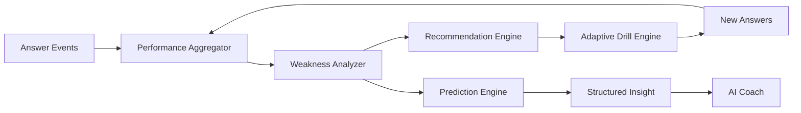

# ExamCoach — Learning Intelligence Specification

## Objective
Convert raw answer behavior into reliable, explainable learning decisions.

## Flow



## Weakness Analyzer Inputs
- correctness
- time spent
- difficulty
- recent performance
- historical performance
- repeated attempts
- sample size

## Weakness Output
- weakness score
- confidence
- trend
- evidence

Never declare a strong weakness from a single question.

## Conceptual Model

```text
WeaknessScore =
  Accuracy
+ Speed
+ DifficultyHandling
+ Consistency
+ Recency
```

Weights are configuration-driven and must be validated experimentally.

## Recommendation
Consider:
- weakness severity
- confidence
- exam importance
- recency
- expected improvement
- estimated effort

Every recommendation must have an explainable reason code.

## Adaptive Drill
Initial composition: 70% weak / 20% medium / 10% strong.

Also consider:
- unseen questions
- spaced repetition
- difficulty progression
- time constraints
- fatigue
- exposure

## Prediction
Possible outputs:
- readiness
- percentile
- estimated passing chance
- projected improvement

Predictions must show uncertainty and never guarantee passing.

## Habit Engine
Track frequency, consistency, streak, plan adherence, and recovery after missed days.

## AI Boundary
Learning Engine = source of truth.
AI Coach = interpretation and communication.

## Experimentation
Version algorithms and support A/B tests and outcome measurement.
