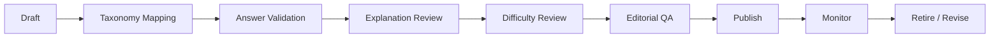

# ExamCoach — Content Operations SOP

## Objective
Create a scalable, legally compliant, quality-controlled content pipeline.

## Sources
- original internal questions
- properly licensed content
- applicable public-domain material
- AI-generated drafts based on validated patterns

Do not scrape copyrighted content without permission or a valid legal basis.

## Lifecycle

## Required Metadata
- provenance
- taxonomy
- answer
- explanation
- difficulty
- estimated time
- status
- author
- reviewer
- version

## AI Content
AI-generated questions remain Draft until validated for correctness, ambiguity, answer uniqueness, distractor quality, language, taxonomy, difficulty, and similarity risk.

The implemented provider-neutral JSON generation, validation, asset import, and
SQLite loading procedure is documented in `AI_Question_Bank_Workflow.md`.

## Quality Gate
No question is published without verified answer/explanation, valid taxonomy, provenance, and reviewer approval.

## Monitoring
Review unusually low accuracy, high skip rate, long response time, user reports, and answer disputes.
