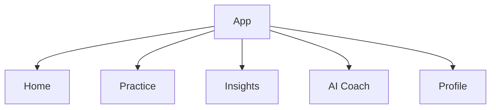

# ExamCoach — Information Architecture

## Primary Navigation

## Home
- Current Exam
- Readiness
- Daily Goal
- Weakest Area
- Recommended Action
- Recent Performance
- Streak
- AI Summary

## Practice
- Tryout
- Previous Attempts
- Adaptive Drill
- Recommended Drill
- Weakness Focus
- Topic Practice
- Speed Practice
- Question Review

## Insights
- Overview
- Strengths
- Weaknesses
- Progress Trend
- Readiness
- Percentile
- Passing-Chance Estimate

## AI Coach
- Today's Insight
- Study Plan
- Why This Matters
- Recommended Drill
- AI Usage/Quota

## Profile
- Account
- Exam Goal
- Subscription
- Notifications
- Offline Data
- Privacy
- Settings

## Principle
Insights should naturally lead to practice; practice should feed the intelligence engine.
