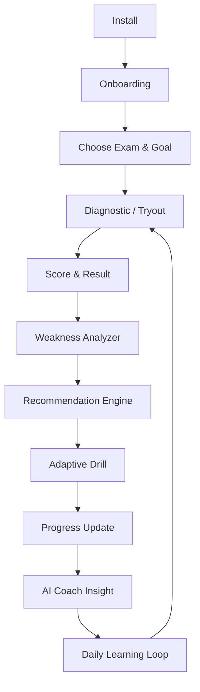

# ExamCoach — Product Requirements Document (PRD)

## Product Vision
Help Indonesian exam candidates improve efficiently through personalization, insight, and habit building.

## Product Pillars
1. Personalization
2. Insight
3. Habit Building
4. Low-Interruption Learning

## Core Flow

## Main Modules
- Authentication
- Home
- Exam Engine
- Tryout
- Practice/Drill
- Result
- Insights
- AI Coach
- Leaderboard
- Subscription
- Profile

## Practice Modes
- Full tryout
- Adaptive drill
- Topic practice
- Speed practice

## Insight
Show:
- strengths
- weaknesses
- trends
- recommended focus
- readiness
- percentile estimate
- passing-chance estimate when statistically justified

## AI Coach
- performance summary
- weakness explanation
- study schedule
- concise motivation

The Step 11 implementation requires a completed deterministic result, shows
server-owned daily quota, supports validated local/server cache, and falls back
to deterministic insight when unavailable. Free schedules can be disabled by
policy; AI never changes official learning output.

## Free/Premium Principle
Free must provide meaningful value and core result visibility. Premium primarily unlocks frequency, depth, personalization, and advanced intelligence.

Offerings, package descriptions, periods, and localized prices come from the
store through RevenueCat. The backend revalidates RevenueCat entitlement before
materializing `premium_1` or `premium_2`; client purchase state is not trusted.

## Initial Drill Policy
70% weak, 20% medium, 10% strong. This is a configurable starting hypothesis and must be experimentally validated.

## MVP Exclusions
- open-ended AI chatbot
- social feed
- tutor marketplace
- live classes
- institution dashboard
- complex gamification

## MVP Success
Prove that users complete tryouts, return for targeted practice, understand recommendations, improve weak areas, engage with AI insights, and convert to paid access.
